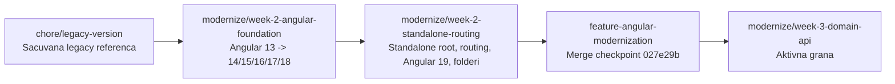
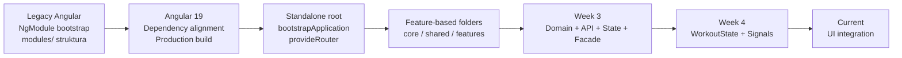

# My Fitness Planner - Modernization Progress

Ovaj dokument prikazuje do sada zavrsenu modernizaciju projekta, git checkpoint-e i sledecu fazu rada.

## Trenutno stanje

- Aktivna grana: `modernize/week-3-domain-api`
- Bazna grana za Week 2: `modernize/week-2-standalone-routing`
- Poslednji Week 2 checkpoint: Angular 19, standalone bootstrap/routing i folder reorganizacija
- Aktivna faza: Week 3 domain/API/State/Facade integracija
- Radno stablo: cisto osim lokalnog, necommitovanog PDF plana
- PDF plan: `src/My_Fitness_Planner_Angular_Modernization_Plan.pdf`

## Git tok modernizacije

```mermaid
gitGraph
   commit id: "legacy baseline"
   branch chore/legacy-version
   checkout feature-angular-modernization
    commit id: "Angular 13-18 foundation"
   commit id: "Angular Material alignment"
   branch modernize/week-2-angular-foundation
   commit id: "Angular 14 foundation"
   commit id: "Angular 15 upgrade"
   commit id: "Angular 16 guards"
   commit id: "Angular 17 upgrade"
   commit id: "Angular 18 upgrade"
   commit id: "Angular 18 dependency alignment"
   branch modernize/week-2-standalone-routing
   commit id: "root component standalone"
   commit id: "bootstrapApplication + provideRouter"
   commit id: "Angular 19 upgrade"
   commit id: "HomeComponent standalone"
   commit id: "folder reorganization"
    commit id: "Workout API + State + Facade"
    commit id: "TrainingList + TrainingForm integration"
   branch modernize/week-3-domain-api
```

## Git grane



## Sta je uradjeno

### Week 1 - Audit i bezbedan pocetak

- Sacuvana legacy referenca kroz `chore/legacy-version`.
- Napravljen modernization branch.
- Dokumentovana trenutna arhitektura u `ARCHITECTURE.md`.
- Mapirani moduli, routing, servisi, state i Firebase data flow.
- Sacuvan pocetni smoke test rezultat.

### Week 2 - Angular upgrade i moderna osnova

- Angular postepeno podignut do v19.
- Uskladjeni Angular CLI, TypeScript, RxJS, Firebase i AngularFire.
- Uskladjeni Angular Material/CDK i ng-bootstrap.
- Root komponenta prebacena na standalone.
- Bootstrap prebacen na `bootstrapApplication`.
- Routing prebacen na `provideRouter`.
- Lazy loading za Workouts i Nutrition je sacuvan.
- `HomeComponent` prebacen na standalone.
- Folder struktura reorganizovana:

```text
src/app/
├── core/
├── shared/
├── material/
└── features/
    ├── workouts/
    └── nutrition/
```

- Workouts feature internals now follow the target boundaries:

```text
features/workouts/
├── adapters/
├── components/
├── models/
├── services/
├── workout.facade.ts
└── workout.state.ts
```

- Production build je prolazio nakon migracionih koraka.

### Dodatne migracije i stabilizacija

- Login/auth tok je prebačen na modularni Firebase Auth/Firestore provider setup.
- `server.js` sada servira Angular browser output iz `dist/my-fitnes-planner-app/browser`.
- `TrainingListComponent` koristi `WorkoutFacade` za učitavanje, query state i delete/finish tok.
- `TrainingFormComponent` koristi `WorkoutFacade` za create/update tok.
- Legacy `Training` model se koristi samo na granici postojeće forme; `Workout` je interni domain model.

### Week 3 - Domain/API/State/Facade integracija

- Definisani `Workout`, `WorkoutExercise`, `WorkoutSet` i CrossFit osnovni tipovi.
- Odvojeni Firestore DTO modeli i DTO <-> domain adapter.
- Napravljen `WorkoutApiService` i tipizovan `WorkoutApiError`.
- Napravljen `WorkoutState` sa Signals query state-om, filterom, sortom i pagination-om.
- Napravljen `WorkoutFacade` sa load/save/create/update/delete/finish flow-ovima.
- `TrainingListComponent` koristi Workout domain model i Facade/State za prikaz i akcije.
- `TrainingFormComponent` create/update koristi Facade i Workout model.
- Preostali legacy bridge postoji samo zbog postojećih form-control naziva.

## Arhitektonska tranzicija



## Week 3 - Domain, API, Adapter, State i Facade

Week 3, na grani `modernize/week-3-domain-api`:

1. [x] Stabilizovati `Workout`, `WorkoutExercise` i `WorkoutSet` domain modele.
2. [x] Definisati Firestore DTO modele odvojene od domain modela.
3. [x] Zavrsiti adapter DTO <-> domain.
4. [x] Izdvojiti API/Firestore service granicu kroz `WorkoutApiService`.
5. [x] Dodati osnovni error handling kroz `WorkoutApiError`.
6. [x] Povezati API service sa `WorkoutState` i `WorkoutFacade`.
7. [x] Implementirati create/update/delete/finish workout flow u facade-u.
8. [x] Povezati `TrainingListComponent` sa `WorkoutFacade`.
9. [x] Prebaciti search, sort i pagination u Signals query state.
10. [x] Prebaciti `TrainingListComponent` prikaz na `Workout` domain polja.
11. [x] Prebaciti `TrainingFormComponent` create/update tok na Facade.
12. [x] Ukloniti poslednji legacy bridge za edit formu.

## Otvorene stavke

- Karma/ChromeHeadless test suite jos nema pouzdan zavrsen rezultat.
- `SharedModule`, `TrainingModule` i `NutritionModule` jos postoje kao prelazni NgModule slojevi.
- Vecina feature/shared komponenti jos nije standalone.
- `AppModule` je zadrzan kao legacy fajl dok se migracija ne stabilizuje.
- PDF plan je lokalni necommitovani artefakt i nije deo source koda.

## Definition of Done za sledeci checkpoint

- [x] Domain modeli imaju jasna imena i odgovornosti.
- [x] DTO modeli ne cure direktno u UI.
- [x] Adapter ima testove za mapiranje u oba smera.
- [x] API granica ima zaseban `WorkoutApiService`.
- [x] API greške imaju tipizovan `WorkoutApiError`.
- [x] `WorkoutState` ima Signals source of truth i `computed()` derived state.
- [x] `WorkoutState` ima unit testove za state transitions i reset.
- [x] `WorkoutState` ima testove za filter, sort i pagination derived state.
- [x] `WorkoutFacade` orkestrira API, adapter i state.
- [x] `WorkoutFacade` ima create/update/delete/finish business flow.
- [x] `WorkoutFacade` ima unit testove za API/state orkestraciju i error flow.
 - [x] Prvi postojeci UI read tok koristi Facade bez menjanja legacy tabele.
- [x] TrainingList delete/deactivate tok koristi `WorkoutFacade.finishWorkout`.
- [x] Uklonjen je neiskorisceni direktni read tok iz `TrainingListComponent`.
- [x] `TrainingListComponent` prikaz, query state i pagination koriste WorkoutFacade/WorkoutState.
- [x] `TrainingListComponent` vise nema zavisnost od legacy `TrainingService`.
- [x] `TrainingFormComponent` create/update tok koristi `WorkoutFacade`.
- [x] `TrainingFormComponent` koristi `Workout` domain model bez `Training` bridge-a.
- [x] `TrainingListComponent` prikazuje `Workout` domain polja.
- [x] `TrainingListComponent` više nema zavisnost od legacy `TrainingService`.
 - Production build prolazi; Karma test runner jos nema pouzdan zavrsen rezultat.
- Promena je izolovana u mali proverljiv commit.
